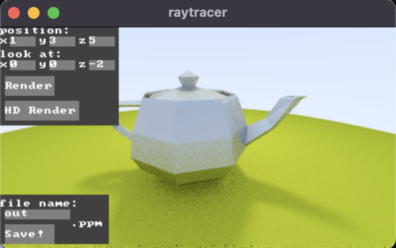

Ray Tracing in One Weekend - Expanded
====================================================================================================

This is a project built upon the book **Ray Tracing in One Weekend** by Peter Shirley.
It implements all original functionality plus some extra functionality, including:

* **Ray Tracing acceleration through bounding volume hierarchy (BVH):** bvh.h, aabb.h, hittable.h
* **Triangle support and loading from OBJ:** tri.h, mesh.h
* **A window and primitive GUI system using SDL3:** window.h, gui/\*
* **Shadows and support for multiple lights** light.h, camera.h

**Notes:**
The GUI system is relatively primitive and requires manual positioning within the window, this would be the main thing I would change in the future.
The makefile is also configured for Mac where SDL3 was installed using homebrew. This should be modified for any other system or configuration.

**Sources:**
[_Ray Tracing in One Weekend_](https://raytracing.github.io/books/RayTracingInOneWeekend.html)
